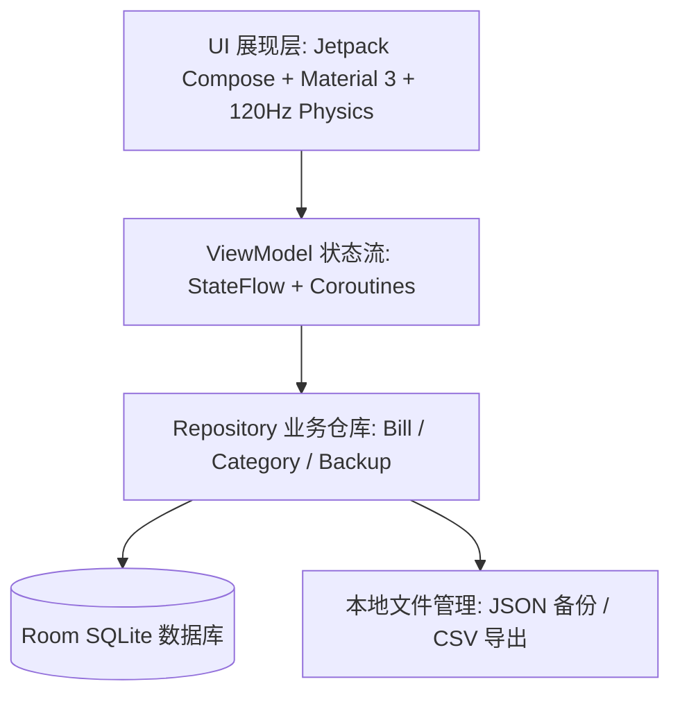

# 📱 本地记账 (LocalBill Recording)

一款基于 **Kotlin + Jetpack Compose (Material 3) + Room 数据库 + MVVM 架构** 构建的**纯本地离线**、**媲美 Linear / Apple 级精密美学** 的 Android 记账应用。

无需申请任何网络权限，100% 本地安全存储，提供两级智能分类聚合、日/周/月/年多维可视化走势图与环形占比分析、120Hz 物理弹簧触感计算键盘、内联手风琴折叠展开统计以及完整数据备份导出。

---

## 🌟 核心特性 (Features)

* 🔒 **100% 纯本地离线隐私**：
  * 零网络权限申请，所有财务数据仅保存在手机本地 SQLite 数据库中，绝不上传云端，彻底杜绝数据泄露。
* ⚡ **120Hz 极速物理弹簧记账键盘**：
  * **触感微缩放**：采用 `Animatable` + `graphicsLayer` 物理弹簧系统，按键按下缩放至 0.93，释放丝滑回弹，零掉帧且不触发全局重组。
  * **长按加速连删**：退格键长按 400ms 后以 60ms 极速连删，每删 3 字触发一次节流微震，手感利落省心。
  * **分类横滑**：双侧引入 16dp 渐变消隐遮罩，点击分类自动平滑居中。
* 📋 **首页吸顶明细与无感撤销 (Sticky Header & Undo)**：
  * **吸顶日期栏**：基于 Compose Foundation `stickyHeader` 实现滚动吸顶，搭配不透明暖骨白底板，告别文字穿透噪点。
  * **左滑删除 + 4秒撤销**：Material 3 `SwipeToDismissBox` 阻尼阈值 38%，左滑露出利落红底垃圾桶；采用**即时写库删除 + 内存快照恢复**，彻底避免后台被杀丢账单。
  * **精密数字翻滚**：汇总金额接入 `AnimatedAmountText`，变动时呈现 450ms `FastOutSlowInEasing` 平滑跳跃。
* 📊 **多维统计与内联手风琴下钻 (Inline Accordion & Gestures)**：
  * **分类手风琴折叠展开**：彻底告别弹窗打断，点击分类卡片直接平滑展开（`expandVertically + fadeIn`），展示细分子类条形占比、金额与笔数。
  * **局域横向手势切换**：日期导航栏支持左右滑动手势快速切日/周/月，手势严格隔离，绝不与贝塞尔曲线图拖拽（Scrubber）产生冲突。
  * **贝塞尔平滑渐变曲线图 & 现代环形图**：平滑折线走势 + 底部渐变填充，支持触控指示线与悬浮消费气泡。
* 🌙 **和风深墨双模态美学 (Warm Bone & Dark Theme)**：
  * **日间暖白纸感**：巴川纸（Tomoe River）暖骨白底色（`#F7F6F3`）搭配松烟墨字（`#2F3437`）与 1px 微边框，消除高光眼疲劳。
  * **和风深墨夜间**：精心调优的 Zinc-900 暗黑模式（`#18181B` 底色，`#27272A` 卡片），彻底避免生硬死黑与 OLED 拖影。
  * 底部导航栏配备 0.8dp 微边框隔断与切换微触感反馈。
* 💾 **数据管理与备份恢复**：
  * **JSON 全量备份**：一键生成结构化备份文本并支持一键无缝还原。
  * **CSV 表格导出**：生成带 UTF-8 BOM 的标准 CSV 表格文件，可直接用 Excel 或 WPS 打开对账。

---

## 🏗️ 系统架构与技术栈



* **开发语言**：Kotlin 2.0.21
* **UI 框架**：Jetpack Compose (BOM 2024.11.00 + Material 3)
* **持久化方案**：Android Room 2.6.1 (SQLite) + KSP 注解处理器
* **异步与并发**：Kotlin Coroutines + `StateFlow` (Reactive UDF 单向数据流架构)
* **工程构建**：AGP 8.7.2 + R8 代码全量优化与混淆
* **质量研发流程**：严格遵循 DevFlow 治理与 AI Lab 三室双盲仲裁规范

---

## 🧪 全通量自动化测试验证 (Test Report)

本项目遵循严谨的测试驱动与自动化质量保障流程，全套测试套件 **100% 绿灯通过**：

| 测试套件 | 测试覆盖点 | 结果 |
| :--- | :--- | :---: |
| **`RoomDatabaseTest`** | In-Memory SQLite 数据库、内置分类初始化、两级关联查询、外键级联安全 | ✅ **PASS** |
| **`CategoryAggregationTest`** | 饮食等两级分类自动聚合算法、子类拆解计算、百分比精确度 | ✅ **PASS** |
| **`DateTimeUtilsTest`** | 日/周/月跨度计算、自然周切分、中文日期格式化 | ✅ **PASS** |
| **`CalculatorEvaluationTest`** | 触感键盘连续加减运算、浮点精度控制（保留2位小数）、边界容错 | ✅ **PASS** |
| **`BackupRestoreTest`** | 全量 JSON 导出、反序列化恢复、数据一致性校验 | ✅ **PASS** |

---

## 🛠️ 构建与运行指南 (Build & Run)

### 环境要求
* Android Studio Ladybug / Koala 或更高版本
* JDK 21
* Android SDK Platform 35 / 36 (Min SDK: 26)

### 命令行编译
```bash
# 执行单元测试
./gradlew testDebugUnitTest

# 编译 Debug APK
./gradlew assembleDebug

# 编译高性能 Release APK (已启用 R8 优化)
./gradlew assembleRelease
```

---

## 📄 开源许可证

本项目采用 [MIT License](LICENSE) 开源许可证。
