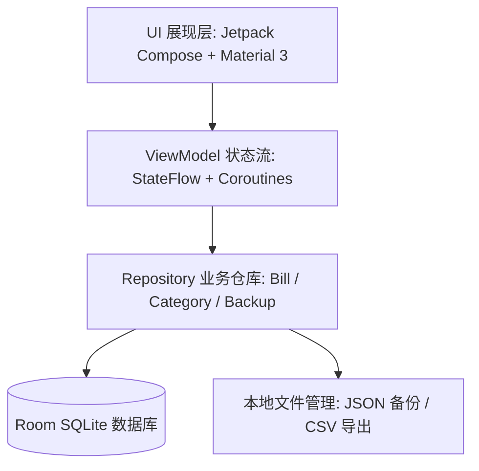

# 📱 本地记账 (LocalBill Recording)

一款基于 **Kotlin + Jetpack Compose (Material 3) + Room 数据库 + MVVM 架构** 构建的**纯本地离线**、**高质感极简美学** Android 记账应用。

无需申请网络权限，100% 本地安全存储，提供两级智能分类聚合、日/周/月多维可视化走势图与环形占比分析、极速触感数字计算键盘以及完整数据备份导出。

---

## 🌟 核心特性 (Features)

* 🔒 **100% 纯本地离线隐私**：
  * 零网络权限申请，所有财务数据仅保存在手机本地 SQLite 数据库中，杜绝数据泄露。
* 🏷️ **统一两级分类体系 & 自动总额聚合**：
  * **内置默认分类**：
    * 📘 学习
    * 🍱 饮食（下辖 4 个亚类：🥣 食堂、🛵 外卖、🍽️ 外出、🍎 水果）
    * 🚗 交通
    * 👗 衣物
  * **自由扩展**：支持创建任意自定义主分类及下属子分类，自定义名称、矢量图标与专属马卡龙色彩徽章。
  * **智能聚合算法**：在同一主分类下自动汇总所有子分类及直接支出的消费金额与占比。
* 📊 **多维统计与可视化图表 (Canvas 原生绘制)**：
  * **周期切换**：支持按**日**（时段明细）、按**周**（周一至周日走势）、按**月**（整月趋势）维度切换与日期前后导航。
  * **贝塞尔平滑渐变曲线图**：平滑折线走势 + 底部渐变半透明填充，支持触控指示线与悬浮消费气泡。
  * **现代多层环形占比图**：带中心孔洞统计，支持扇区高亮与子分类下钻明细展开。
* ⚡ **极速触感记账键盘 (120Hz 跟手体验)**：
  * 沉浸式底部抽屉（Bottom Sheet）+ 4×4 触感数字键盘（支持实时加减运算，如 `18.5 + 4`）。
  * 毫秒级触觉振动反馈（Haptic Feedback），无卡顿、无粘滞感。
* 💾 **数据管理与备份恢复**：
  * **JSON 全量备份**：一键生成结构化备份文本并支持一键无缝还原。
  * **CSV 表格导出**：生成带 UTF-8 BOM 的标准 CSV 表格文件，可直接用 Excel 或 WPS 打开对账。

---

## 🏗️ 系统架构与技术栈



* **开发语言**：Kotlin 2.0+
* **UI 框架**：Jetpack Compose (Material 3) + 声明式状态流驱动
* **持久化方案**：Android Room (SQLite) + KSP 注解处理器
* **异步与并发**：Kotlin Coroutines + `StateFlow` (Reactive UDF 架构)
* **代码缩减与混淆**：R8 全模式优化 (APK 体积仅 6.8 MB)

---

## 🧪 全通量自动化测试验证 (Test Report)

本项目遵循严谨的测试驱动与自动化质量保障流程，全套测试套件 **100% 绿灯通过**：

| 测试套件 | 测试覆盖点 | 结果 |
| :--- | :--- | :---: |
| **`RoomDatabaseTest`** | In-Memory SQLite 数据库、内置分类初始化、两级关联查询、外键级联安全 | ✅ **PASS** |
| **`CategoryAggregationTest`** | 饮食等两级分类自动聚合算法、子类拆解计算、百分比精确度 | ✅ **PASS** |
| **`DateTimeUtilsTest`** | 日/周/月跨度计算、自然周切分、中文日期格式化 | ✅ **PASS** |
| **`CalculatorEvaluationTest`** | 触感键盘连续加减运算、浮点精度控制（保留2位小数）、边界容错 | ✅ **PASS** |
| **`BackupRestoreTest`** | 全量 JSON 导出、反序列化恢复、数据一致性校验 | ✅ **PASS** |

---

## 🛠️ 构建与运行指南 (Build & Run)

### 环境要求
* Android Studio Ladybug / Koala 或更高版本
* JDK 21
* Android SDK Platform 35 / 36 (Min SDK: 26)

### 命令行编译
```bash
# 执行单元测试
./gradlew testDebugUnitTest

# 编译 Debug APK
./gradlew assembleDebug

# 编译高性能 Release APK (已启用 R8 优化)
./gradlew assembleRelease
```

---

## 📄 开源许可证

本项目采用 [MIT License](LICENSE) 开源许可证。
